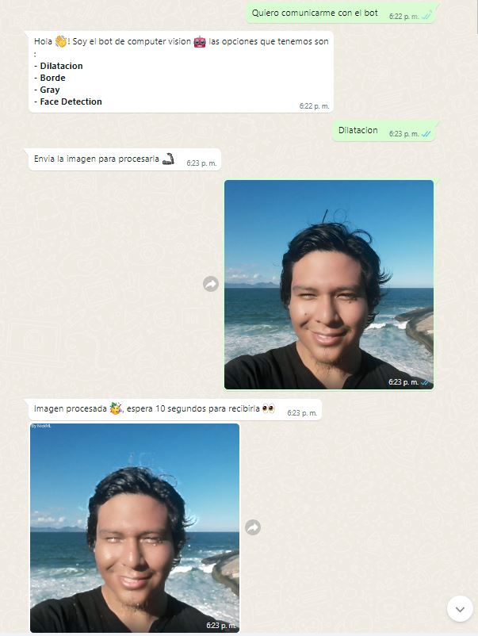
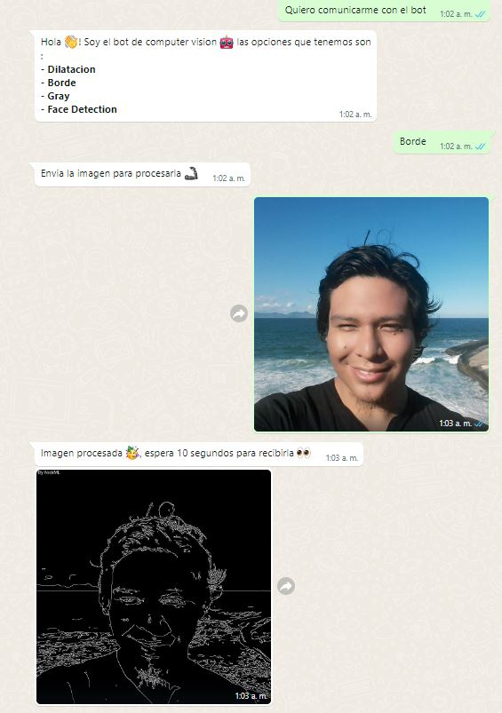
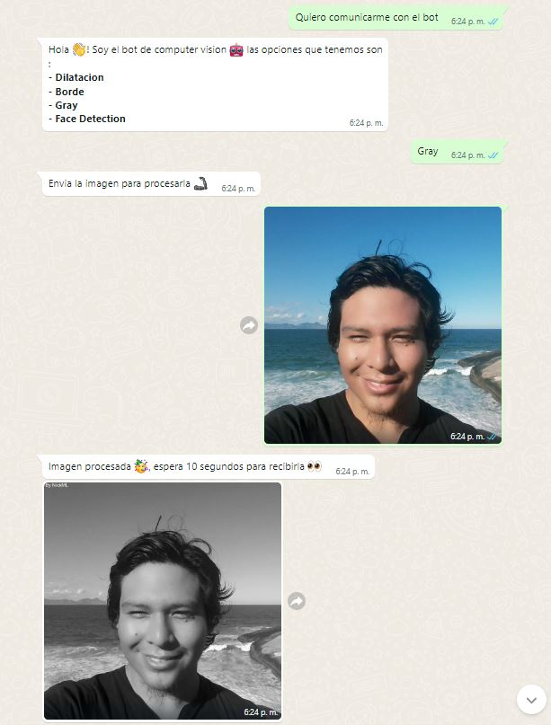
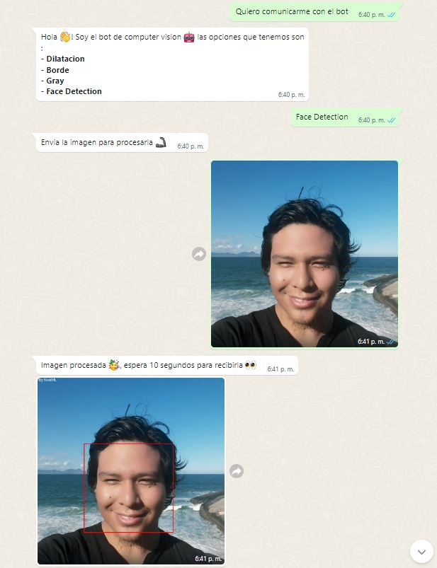

# WhatsAppComputerVision

## Índice

* [1. Motivacion](#1-Motivacion)
* [2. Instalacion](#2-Instalacion)
* [3. Inicio de sesion](#3-Inicio-de-sesion)
* [4. Computer Vision](#4-Computer-Vision)
* [5. Creacion de filtros](#5-Creacion-de-filtros)

***
## 1. Motivacion

WhatsAppComputerVision es un proyecto chatbot de WhatsApp que tiene como opciones de tecnicas de procesamiento de imagenes y vision artificial. Se desarrollo con el lenguaje javascript usando la libreria [whatsapp-web.js](https://wwebjs.dev/guide/) desarrollada por [Pedro S. Lopez](https://github.com/pedroslopez)

<br>
<p align="center"></p>
<br/>

***
## 2. Instalacion

Para la instalacion de WhatsAppComputerVision se requiere de :

* Editor de texto ( Visual Studio Code )
* Node (v12.20.1)
* npm (v6.14.10)
* git

Una vez tengamos listo lo anterior, instalamos el proyecto. Abrimos el GitBash (click derecho sobre el escritorio) y aplicamos los siguientes comandos.

*  ```mkdir ./ejemplo ```
*  ```cd ./ejemplo ```
*  ```git clone https://github.com/edwinml148/WhatsAppComputerVision ```
*  ```cd ./WhatsAppComputerVision ```
*  ```npm install ```
*  ```code . ```

<br>
<p align="center"></p>
<br/>

***

## 3. Inicio de sesion

Para usar el chatbot se necesita de un usuario de WhatsApp y un inicio de sesion. Una vez estemos en el Visual Studio Code abrimos el terminal gitbash y aplicamos el comando  ```node app.js```

<br>
<p align="center"></p>
<br/>

Iniciamos session con nuestro dispositivo con ese QR. Inmediatamente observaremos que se apertura una session en un ordenador (Mac OS) , esto es una caracteristica de ```whatsapp-web.js```. Veremos tambien que se creo una carpeta ```.wwebjs_auth``` aqui se encuentra almacenada la session de WhatsApp. **Se recomienda no compartir dicho archivo ya que se podria abrir tu session desde otro ordenador**. 

<br>
<p align="center"></p>
<br/>

***
## 4. Computer Vision

Para le procesamiento de las imagenes se uso el packete ```openCV.js``` y ```jimp```. Y para la lectura de las imagenes usamos los modulo ```fs``` y ```jpeg```. Las opciones del chatbot son:

### 4.1 Dilatacion
La dilatacion es una operacion morfologica que en imagenes en escala de grises amplifica las intensidades cercanas al 255 (Color Blanco).

<br>
<p align="center"></p>
<br/>

### 4.2 Borde
La operacion de Borde usa el algoritmo de Canny , el cual detecta los pixeles donde hay variaciones de intensidad reemplazandolo por la intensidad 255 (Blanco) y los demas dejandolos con la intensidad 0 (Negro).

<br>
<p align="center"></p>
<br/>

### 4.3 Gray
La operacion de Gray convierte una imagen RGB en escala de grises

<br>
<p align="center"></p>
<br/>

### 4.4 Face Detection
La operacion Face Detection usa un clasificador pre-entrenado HaarCascade y el algoritmo de detectMultiScale. Para la deteccion de rostros.

<br>
<p align="center"></p>
<br/>
