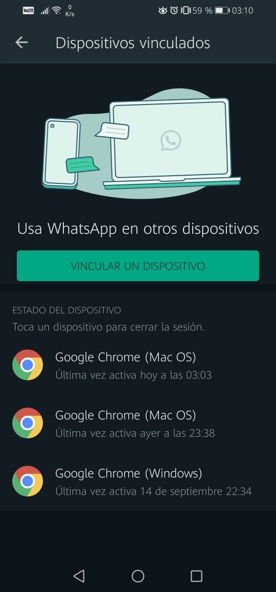

# WhatsAppComputerVision

## Índice

* [1. Motivacion](#1-Motivacion)
* [2. Instalacion](#2-Instalacion)
* [3. Inicio de sesion](#3-Inicio-de-sesion)
* [4. Filtros personalizados](#4-Filtros-personalizados)
* [5. Creacion de filtros](#5-Creacion-de-filtros)


***

## 1. Motivacion

WhatsAppComputerVision es un proyecto chatbot de WhatsApp que tiene como opciones de tecnicas de procesamiento de imagenes y vision artificial. Se desarrollo con el lenguaje javascript usando la libreria [whatsapp-web.js](https://wwebjs.dev/guide/) desarrollada por [Pedro S. Lopez](https://github.com/pedroslopez)

<div style="text-align: center;">
  <br>
  
  <br/>
  <br><br/>
</div>

***
## 2. Instalacion

Para la instalacion de WhatsAppComputerVision se requiere de :

* Editor de texto ( Visual Studio Code )
* Node (v12.20.1)
* npm (v6.14.10)
* git

Una vez tengamos listo lo anterior, instalamos el proyecto. Abrimos el GitBash (click derecho sobre el escritorio) y aplicamos los siguientes comandos.

*  ```mkdir ./ejemplo ```
*  ```cd ./ejemplo ```
*  ```git clone https://github.com/edwinml148/WhatsAppComputerVision ```
*  ```cd ./WhatsAppComputerVision ```
*  ```npm install ```
*  ```code . ```

<div style="text-align: center;">
  <br>
  
  <br/>
  <br><br/>
</div>

***

## 2. Inicio de sesion

Para usar el chatbot se necesita de un usuario de WhatsApp y un inicio de sesion. Una vez estemos en el Visual Studio Code abrimos el terminal gitbash y aplicamos el comando  ```node app.js```

<div style="text-align: center;">
  <br>
  
  <br/>
  <br><br/>
</div>

Iniciamos session con nuestro dispositivo con ese QR. Inmediatamente observaremos que se apertura una session en un ordenador (Mac OS) , esto es una caracteristica de ```whatsapp-web.js```

<div style="text-align: center;">
  <br>
  
  <br/>
  <br><br/>
</div>